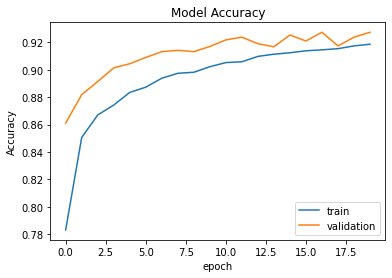

# Convolutional Neural Network for Fashion-MNIST Classification

A **simple CNN** built with **TensorFlow/Keras** to classify images from the **Fashion-MNIST** dataset (e.g., T-shirts, shoes, etc.). The model uses a **channels-first** input format and achieves **91.94% accuracy** on the test set.

---

## 📌 Overview
This project implements a **Convolutional Neural Network (CNN)** to classify grayscale images (28x28 pixels) from the **Fashion-MNIST** dataset. The model is designed with:
- **Two convolutional layers**
- **Two max-pooling layers**
- **Two dropout layers** (for regularization)
- **Two dense layers** (fully connected)

The architecture is optimized for performance and simplicity, making it a great starting point for image classification tasks.

---

## 📊 Model Architecture

| Layer (Type)               | Output Shape         | Parameters |
|----------------------------|----------------------|------------|
| `Conv2D`                   | (None, 64, 28, 28)   | 320        |
| `MaxPooling2D`             | (None, 64, 14, 14)   | 0          |
| `Dropout`                  | (None, 64, 14, 14)   | 0          |
| `Conv2D`                   | (None, 32, 14, 14)   | 8,224      |
| `MaxPooling2D`             | (None, 32, 7, 7)     | 0          |
| `Dropout`                  | (None, 32, 7, 7)     | 0          |
| `Flatten`                  | (None, 1,568)        | 0          |
| `Dense`                    | (None, 256)          | 401,664    |
| `Dropout`                  | (None, 256)          | 0          |
| `Dense` (Output)           | (None, 10)           | 2,570      |

**Total Parameters:** 412,778
**Trainable Parameters:** 412,778
**Non-trainable Parameters:** 0

---

## 🔧 Training Details
- **Loss Function:** Categorical Crossentropy
- **Optimizer:** Adam
- **Batch Size:** 64
- **Epochs:** 20

---

## 📈 Performance
- **Test Accuracy:** **91.94%**
- **Training History:**
  
  

---

## 📂 Dataset
- **Fashion-MNIST**: A [dataset](https://github.com/zalandoresearch/fashion-mnist) of 70,000 grayscale images (28x28 pixels) across 10 fashion categories.
- **Input Format:** Channels-first (`[channels, height, width]`), where `channels=1` (grayscale).
